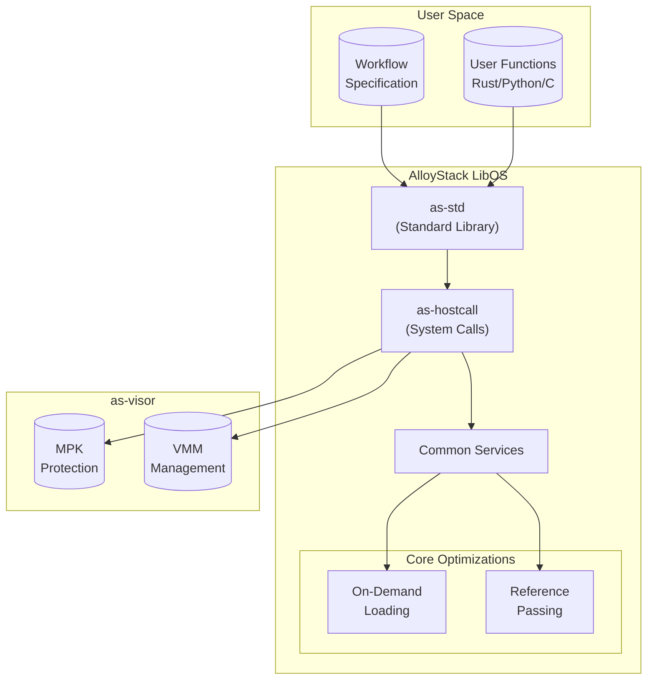
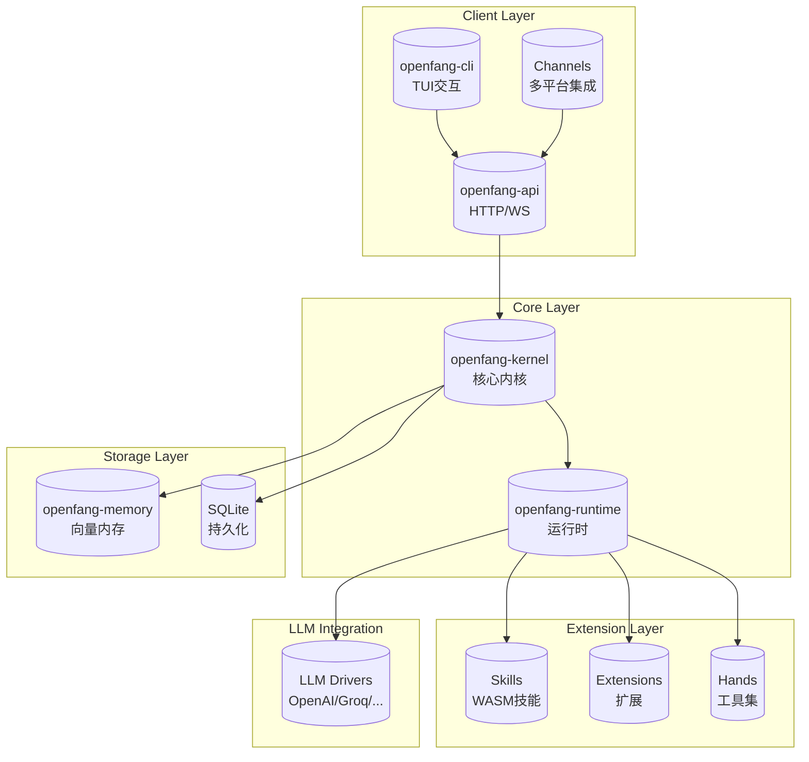
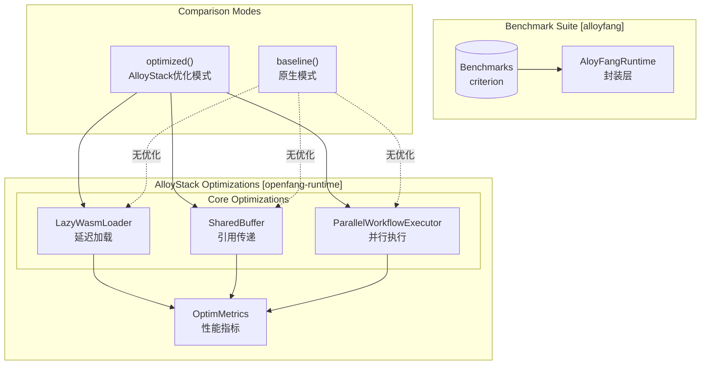

# AlloyStack Benchmarks

Benchmark suite for AlloyStack serverless workflow optimizations.

## Projects

| Project | Description |
|---------|-------------|
| **alloyfang** | Benchmarks comparing OpenFang vs AlloyStack-optimized performance |
| **openfang** | Agent Operating System - open source implementation |
| **AlloyStack** | Library OS for serverless workflow applications (EuroSys 2025) |

## 架构图

### 1. AlloyStack 架构图



**核心组件说明：**
- **as-std**: 标准库，为用户函数提供统一的 API
- **as-hostcall**: 系统调用接口，处理请求
- **common_service**: LibOS 模块（文件系统、网络等）
- **On-Demand Loading**: 按需加载，优化冷启动
- **Reference Passing**: 引用传递，减少数据传输开销
- **as-visor**: 虚拟机管理器，基于 MPK 做隔离

---

### 2. OpenFang 架构图



**核心组件说明：**
- **openfang-cli**: TUI 交互界面
- **openfang-api**: HTTP/WebSocket API 服务
- **openfang-channels**: 多平台消息通道（Slack、Telegram 等）
- **openfang-kernel**: 核心内核，管理 agent 生命周期
- **openfang-runtime**: 运行时环境，执行 agent 逻辑
- **openfang-memory**: 向量内存存储
- **Skills**: WASM 技能模块（沙箱执行）
- **LLM Drivers**: LLM 驱动抽象

---

### 3. AlloyFang 架构图



**AlloyFang 工作流程：**
1. 通过 `AloyFangRuntime::optimized()` 启用所有 AlloyStack 优化
2. 通过 `AloyFangRuntime::baseline()` 禁用所有优化作为基准
3. Benchmark 对比两种模式的性能差异

---

## Quick Start

```bash
# Build benchmarks
cargo build --release -p alloyfang

# Run all benchmarks
./alloyfang/scripts/run_all_benchmarks.sh

# Run with criterion (generates HTML reports)
cargo bench -p alloyfang
```

## AlloyFang 设计实现

### 概述

AlloyFang = OpenFang + AlloyStack 优化，旨在测试和对比 openfang 原生性能与 AlloyStack 优化版本之间的性能差距。

### 核心架构

```
alloyfang/                      # Benchmark 套件
├── src/lib.rs                  # AloyFangRuntime 封装
├── benches/                    # 各类基准测试
└── scripts/                    # 运行脚本

openfang/crates/openfang-runtime/src/alloystack_optim/  # 核心优化实现
├── mod.rs                      # AlloyStackRuntime 运行时
├── lazy_loader.rs              # 延迟加载 WASM 模块
├── reference_passing.rs        # 零拷贝数据共享
├── parallel_executor.rs        # 并行工作流执行
└── metrics.rs                  # 性能指标收集
```

### 三大优化技术

#### 1. Lazy Loading (延迟加载)
- **位置**: `openfang-runtime/src/alloystack_optim/lazy_loader.rs`
- **原理**: WASM 模块字节码先注册，不立即编译，首次调用时才编译
- **优势**: 减少冷启动时间
- **实现**: 使用 LRU 缓存淘汰 least-recently-used 模块

```rust
// 使用方式
let mut loader = LazyWasmLoader::new(64);
loader.register_module("skill_v1", wasm_bytes);  // 仅注册，不编译
let module = loader.get_or_compile("skill_v1").unwrap();  // 首次访问时编译
```

#### 2. Reference Passing (引用传递)
- **位置**: `openfang-runtime/src/alloystack_optim/reference_passing.rs`
- **原理**: 跨 agent 数据共享，使用共享内存池避免数据拷贝
- **优势**: 零拷贝数据传输，减少内存开销

#### 3. Parallel Execution (并行执行)
- **位置**: `openfang-runtime/src/alloystack_optim/parallel_executor.rs`
- **原理**: 依赖感知的并行工作流执行
- **优势**: 最大化并发吞吐量

### 使用方式

```rust
use alloyfang::AloyFangRuntime;

// AlloyStack优化模式 (alloyfang) - 所有优化开启
let runtime = AloyFangRuntime::optimized();

// Baseline模式 - 所有优化关闭 (原生 openfang)
let runtime = AloyFangRuntime::baseline();

// 获取优化组件
let loader = runtime.runtime().loader();
let shared_buffers = runtime.shared_buffers();
let executor = runtime.executor();
let metrics = runtime.metrics();
```

## Benchmark Suite

The `alloyfang` crate provides benchmarks for three key AlloyStack optimizations:

1. **Lazy Loading**: On-demand WASM module loading
2. **Reference Passing**: Zero-copy data sharing between functions
3. **Parallel Execution**: Concurrent workflow execution

### Available Benchmarks

| Benchmark | 描述 |
|-----------|------|
| `cold_start` | 冷启动时间测量 |
| `memory_usage` | 内存消耗分析 |
| `tool_execution` | 工具执行性能 |
| `reference_passing` | 引用传递优化效果 |
| `parallel_execution` | 并行执行效率 |
| `agent_loop` | Agent 循环性能 |

## Requirements

- Rust 2021 edition
- Linux (for memory measurements)
